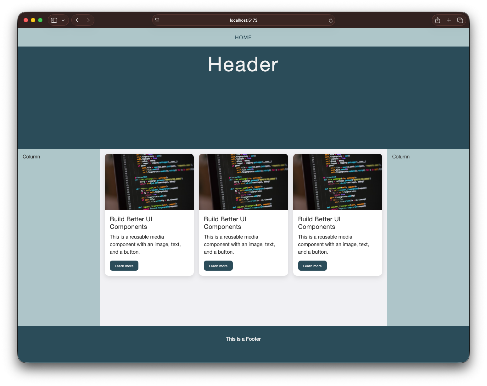

# React Page Layout with Components

Test the solution here: https://cederdorff.com/react-vite-page-layout/

---

> **How to work:** Do this on your own — but sit next to someone with coding experience so you can ask for help along the way.

---

## What You Are Building



You will build a React page with 4 components:

1. Navigation
2. Header
3. MainContent
4. Footer

You must create the React project yourself.
You can copy-paste the CSS styling in step 2.
You will test in small steps as you build.

## Choose Your Support Level

Use one of these two modes while doing the same exercise:

1. Guided mode (beginner): open all help toggles (`<details>`) and use the starter code.
2. Independent mode (experienced): do the numbered tasks first, and only open help toggles if you get stuck.

<details>
<summary>Need help? How to use the toggles</summary>

- Click the small triangle or summary text to expand help.
- If you are in guided mode, open every help block before coding.
- If you are in independent mode, keep help blocks closed and treat them as backup hints.

</details>

---

## 0. Create a New React Project

Create a new project named react-page-layout. If you do not remember how to set up a new React project, follow step 1 in [Getting started with React](/0fd48b8ae90a438bb6ec8dc95628f13f?pvs=25).

### Checkpoint

If setup worked, you should have:

1. A folder named react-page-layout.
2. A local dev server running.
3. A URL in terminal (normally localhost).

---

## 1. Clean Up the Starter Project

Delete the file `src/App.css`.

### Also clean App.jsx

1. Open `src/App.jsx`.
2. Remove the `import './App.css'` line at the top.
3. Replace the whole file with this minimal component:

```jsx
export default function App() {
  return <main>TODO</main>;
}
```

### Checkpoint

App still runs in browser without compile errors.

---

## 2. Add the Styling (Copy-Paste)

Now that the starter is cleaned up, paste this CSS into `src/styles.css`.

```css
/* ---------- root variables ---------- */
:root {
  --green: rgb(38, 76, 89);
  --green-opacity: rgba(38, 76, 89, 0.2);
  --light-green: rgb(172, 198, 201);
  --light-grey: #f1f1f4;
  --text-color-light: #f1f1f1;
  --text-color-dark: #333;
  --white: #fff;
  --font-family: "Helvetica Neue", Helvetica, Arial, sans-serif;
}

/* ---------- general styling ---------- */
html,
body {
  color: var(--text-color-dark);
  font-family: var(--font-family);
  margin: 0;
  padding: 0;
  border: 0;
  outline: 0;
  background-color: var(--light-grey);
}

h1 {
  font-size: 2em;
  font-weight: 400;
  letter-spacing: 3px;
}

h2 {
  font-weight: 400;
  letter-spacing: 0.3px;
  margin: 0.2em 0;
}

h3 {
  font-weight: 400;
  letter-spacing: 1px;
  margin: 0.5em 0 0.2em;
}

img {
  width: 100%;
  height: auto;
}

a {
  color: var(--green);
}

/* ---------- nav styling ---------- */
nav {
  background-color: var(--light-green);
  position: fixed;
  top: 0;
  left: 0;
  right: 0;
  text-align: center;
  grid-area: nav;
}

/* Style the links inside the navigation bar */
nav a {
  display: inline-block;
  color: var(--green);
  text-align: center;
  padding: 20px 16px;
  text-decoration: none;
  letter-spacing: 0.1em;
  text-transform: uppercase;
}

/* Change the color of links on hover */
nav a:hover {
  background-color: var(--light-grey);
}

/* Add a color to the active/current link */
nav a.active {
  background-color: var(--light-green);
}

/* ---------- page grid styling ---------- */

/* The grid container */
.page-layout {
  display: grid;
  grid-template-areas:
    "nav"
    "header"
    "left"
    "middle"
    "right"
    "footer";
}

/* Responsive layout - makes the three columns stack on top of each other instead of next to each other */
@media (min-width: 600px) {
  .page-layout {
    grid-template-areas:
      "nav nav nav"
      "header header header"
      "left middle right"
      "footer footer footer";
  }
}

@media (min-width: 1200px) {
  .page-layout {
    grid-template-areas:
      "nav nav nav nav"
      "header header header header"
      "left middle middle right"
      "footer footer footer footer";
  }
}

/* Style the header */
header,
.header {
  grid-area: header;
  background-color: var(--green);
  color: var(--text-color-light);
  text-align: center;
  font-size: 2em;
  height: 30vh;
  padding: 1em;
}

.left,
.middle,
.right {
  padding: 1em;
  height: calc(50vh);
}

/* Style the left column */
.left {
  grid-area: left;
  background-color: var(--light-green);
}

/* Style the middle column */
.middle {
  grid-area: middle;
}

/* Style the right column */
.right {
  grid-area: right;
  background-color: var(--light-green);
}

/* Style the footer */
footer,
.footer {
  padding: 1em;
  grid-area: footer;
  text-align: center;
  background-color: var(--green);
  color: var(--text-color-light);
  height: 15vh;
}
```

Also confirm that `src/main.jsx` imports the stylesheet:

```jsx
import "./styles.css";
```

### Styling and className help (important)

In React, you use `className` in JSX. In CSS, you style classes with a dot (`.`).

Examples:

- JSX: `<main className="page-layout">`
- CSS: `.page-layout { ... }`
- JSX: `<section className="left">`
- CSS: `.left { ... }`

Rule to remember: text inside `className="..."` must match the CSS class name exactly.

Common mistakes:

- writing `class=` instead of `className=` in JSX
- typo mismatch like `className="PageLayout"` but CSS has `.page-layout`
- forgetting the `.` in CSS class selectors

### Checkpoint

Project still runs after saving.

---

## 3. Create the Components Folder and Files

In this step, you will build and test one component at a time.

Independent mode: complete each numbered task without opening the help toggles.
Guided mode: open each "Need help?" toggle and use the starter code.

Keep your dev server running while you work.

```bash
npm run dev
```

### 3.1 Create the folder

1. In `src`, create a new folder named `components`.

### 3.2 Create and test Navigation.jsx

1. Inside `src/components`, create `Navigation.jsx`.
2. Build a component that renders a `nav` with one `Home` link.

<details>
<summary>Need help? Show starter Navigation.jsx</summary>

```jsx
export default function Navigation() {
  return (
    <nav>
      <a href="#">Home</a>
    </nav>
  );
}
```

</details>

3. Open `src/App.jsx` and temporarily render only Navigation:

<details>
<summary>Need help? Show App.jsx for Navigation only</summary>

```jsx
import Navigation from "./components/Navigation";

export default function App() {
  return (
    <main className="page-layout">
      <Navigation />
    </main>
  );
}
```

</details>

4. Save and check browser:

- You should see the top bar with Home.
- No red errors in editor.

### 3.3 Create and test Header.jsx

1. Inside `src/components`, create `Header.jsx`.
2. Build a component that renders a `header` with an `h1` saying `Header`.

<details>
<summary>Need help? Show starter Header.jsx</summary>

```jsx
export default function Header() {
  return (
    <header>
      <h1>Header</h1>
    </header>
  );
}
```

</details>

3. Update `src/App.jsx` so it renders Navigation and Header:

<details>
<summary>Need help? Show App.jsx for Navigation + Header</summary>

```jsx
import Navigation from "./components/Navigation";
import Header from "./components/Header";

export default function App() {
  return (
    <main className="page-layout">
      <Navigation />
      <Header />
    </main>
  );
}
```

</details>

4. Save and check browser:

- You should see Home at the top and Header below.
- No red errors in editor.

### 3.4 Create and test MainContent.jsx

1. Inside `src/components`, create `MainContent.jsx`.
2. Build a component with three `section` elements using class names `left`, `middle`, and `right`.

<details>
<summary>Need help? Show starter MainContent.jsx</summary>

```jsx
export default function MainContent() {
  return (
    <>
      <section className="left">Column</section>
      <section className="middle">Column</section>
      <section className="right">Column</section>
    </>
  );
}
```

</details>

Class matching reminder:

- `className="left"` is styled by `.left` in `src/styles.css`
- `className="middle"` is styled by `.middle` in `src/styles.css`
- `className="right"` is styled by `.right` in `src/styles.css`

3. Update `src/App.jsx` so it renders Navigation, Header, and MainContent:

<details>
<summary>Need help? Show App.jsx for Navigation + Header + MainContent</summary>

```jsx
import Navigation from "./components/Navigation";
import Header from "./components/Header";
import MainContent from "./components/MainContent";

export default function App() {
  return (
    <main className="page-layout">
      <Navigation />
      <Header />
      <MainContent />
    </main>
  );
}
```

</details>

4. Save and check browser:

- You should now see the three Column areas.
- No red errors in editor.

### 3.5 Create and test Footer.jsx

1. Inside `src/components`, create `Footer.jsx`.
2. Build a component that renders a `footer` with the text `This is a Footer`.

<details>
<summary>Need help? Show starter Footer.jsx</summary>

```jsx
export default function Footer() {
  return (
    <footer>
      <p>This is a Footer</p>
    </footer>
  );
}
```

</details>

3. Update `src/App.jsx` so it renders all four components:

<details>
<summary>Need help? Show App.jsx for all four components</summary>

```jsx
import Navigation from "./components/Navigation";
import Header from "./components/Header";
import MainContent from "./components/MainContent";
import Footer from "./components/Footer";

export default function App() {
  return (
    <main className="page-layout">
      <Navigation />
      <Header />
      <MainContent />
      <Footer />
    </main>
  );
}
```

</details>

4. Save and check browser:

- You should see Navigation, Header, 3 columns, and Footer.
- No red errors in editor.

### 3.6 Quick check before moving on

1. Confirm all four files exist in `src/components`.
2. Confirm each file has one exported component.
3. Confirm App imports all four components.
4. Confirm there are no red errors in the editor.

### Checkpoint

No red errors in editor.

---

## 4. Build the Page Structure in App.jsx

Now lock in the final App file.

### In src/App.jsx

Replace the whole file with:

```jsx
import Navigation from "./components/Navigation";
import Header from "./components/Header";
import MainContent from "./components/MainContent";
import Footer from "./components/Footer";

export default function App() {
  return (
    <main className="page-layout">
      <Navigation />
      <Header />
      <MainContent />
      <Footer />
    </main>
  );
}
```

### Checkpoint

You can now see all 4 parts in browser. The CSS styling should also be applied.


Next step: complete the core checklist in section 5.

---

## 5. Core Tasks (Required)

Complete all:

Run these validation commands before you complete item 6:

```bash
npm run lint
npm run build
```

1. Project is created from scratch.
2. App.css is removed and App.jsx is cleaned.
3. 4 components are created in separate files.
4. App composes the 4 components in the correct order.
5. CSS is applied from styles.css.
6. `npm run lint` and `npm run build` both pass.

---

## 6. Media Component Exercise

After you complete all core tasks in section 5, continue with this exercise.

Build one extra component with image, text, and button, inspired by this design reference:


### 6.1 Create the component file

1. Create `src/components/MediaCard.jsx`.
2. Build a component with these parts:

- one image
- one heading
- one paragraph
- one button

3. Keep semantic HTML (`article`, `h2`, `p`, `button`).

<details>
<summary>Need help? Show starter MediaCard.jsx</summary>

```jsx
export default function MediaCard() {
  return (
    <article className="media-card">
      
      <div className="media-card-content">
        <h2 className="media-card-title">Build Better UI Components</h2>
        <p className="media-card-text">
          This is a reusable media component with an image, text, and a button.
        </p>
        <button className="media-card-button">Learn more</button>
      </div>
    </article>
  );
}
```

</details>

### 6.2 Add the component to your page

1. Open `src/components/MainContent.jsx`.
2. Import `MediaCard`.
3. Render `<MediaCard />` inside the middle section.

### 6.3 Style the component

1. Open `src/styles.css`.
2. Create CSS classes for the media component (`.media-card`, image, content, title, text, button).
3. Minimum styling requirements:

- rounded corners
- spacing between elements
- visible button hover state
- readable text contrast

<details>
<summary>Need help? Show starter CSS for media card</summary>

```css
.media-card {
  background: #fff;
  border-radius: 12px;
  overflow: hidden;
  box-shadow: 0 6px 16px rgba(0, 0, 0, 0.12);
}

.media-card-image {
  display: block;
  width: 100%;
  height: 180px;
  object-fit: cover;
}

.media-card-content {
  padding: 1rem;
}

.media-card-title {
  margin: 0 0 0.5rem;
  font-size: 1.25rem;
}

.media-card-text {
  margin: 0 0 1rem;
  line-height: 1.5;
}

.media-card-button {
  background: var(--green);
  color: var(--text-color-light);
  border: 0;
  border-radius: 8px;
  padding: 0.6rem 1rem;
  cursor: pointer;
}

.media-card-button:hover,
.media-card-button:focus-visible {
  background: #1f404b;
}
```

</details>

4. Then adjust colors/text/spacing to better match the reference image.

### 6.4 Test and verify

1. Save and test in browser.
2. Verify on both narrow and wide screen sizes.
3. Confirm there are no red errors in the editor.

### Checkpoint

You can see a media component with image, text, and button in the middle area.

### 6.5 Extend: show 3 cards in a media-grid

Now extend your solution so the middle area shows a responsive grid with 3 media cards.

1. Open `src/components/MainContent.jsx`.
2. Wrap your cards in a container with class `media-grid`.
3. Render `MediaCard` three times inside the grid.

<details>
<summary>Need help? Show MainContent.jsx with 3-card grid</summary>

```jsx
import MediaCard from "./MediaCard";

export default function MainContent() {
  return (
    <>
      <section className="left">Column</section>
      <section className="middle">
        <div className="media-grid">
          <MediaCard />
          <MediaCard />
          <MediaCard />
        </div>
      </section>
      <section className="right">Column</section>
    </>
  );
}
```

</details>

4. Open `src/styles.css`.
5. Add grid styling for `.media-grid`.

<details>
<summary>Need help? Show starter CSS for media-grid</summary>

```css
.media-grid {
  display: grid;
  grid-template-columns: repeat(auto-fit, minmax(220px, 1fr));
  gap: 1rem;
}
```

</details>

6. Save and test:

- On smaller screens, cards should stack.
- On wider screens, cards should line up in multiple columns.

### Final checkpoint for section 6

You can see a responsive media-grid with 3 cards in the middle area.

---

## 7. Stretch Tasks (If You Finish Early)

Choose at least 2:

1. Add one more nav link.
2. Add hover and keyboard focus styling for nav links.
3. Refactor MainContent so columns come from an array with .map().
4. Pass Header title as a prop from App.
5. Create src/components/index.js and import components from one place.

---

## 8. Reference

- GitHub repository: https://github.com/cederdorff/react-vite-page-layout
- Live solution: https://cederdorff.com/react-vite-page-layout/

---

Good luck with the exercise.
